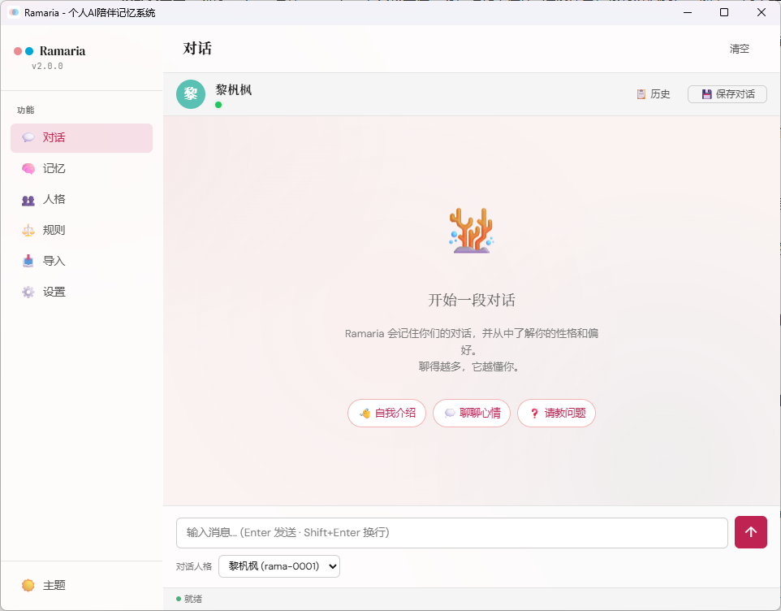

<div align="center">


# 珊瑚菌 · Ramaria 2.4

> 大模型懂一切，唯独不懂你。

**以「记忆」为核心的本地优先个人 AI 陪伴系统，随对话持续理解你。**

[](https://www.rust-lang.org/)
[](LICENSE)
[](https://github.com/entergirl/Ramaria-s)

**[下载安装](https://github.com/entergirl/Ramaria-s/releases) · [桌面使用指南](docs/desktop-user-guide.md) · [隐私说明](docs/privacy-notice.md)**

</div>

---

## 项目简介

现有的 AI 助手普遍存在同一个缺陷：没有记忆。每次对话都从零开始，无论此前交流过多少内容，下一次仍然是陌生的开始。

Ramaria（珊瑚菌）正是为解决这一问题而设计。它是一款运行在个人电脑上的 AI 陪伴软件，以「记忆」为核心：

- **持续积累关于你的记忆**：不仅记住对话本身，也记录你的经历、关心的事物与思考方式，包括日常中一闪而过、本人未必留意的细节；
- **逐步形成对你的理解**：随着对话增多，它会归纳你的性格特征与行为习惯，回应也越来越贴合你本人；
- **数据完全属于你**：所有对话与记忆存储在本机数据库中，选用本地模型时可完全离线运行，不经过任何服务器，也不包含任何遥测。

与每次对话都重新开始的通用 AI 不同，Ramaria 会在长期使用中持续积累对你的理解。

---

## 核心能力

| 能力 | 说明 |
|------|------|
| **长期陪伴对话** | 此前聊过的内容会在后续对话中被自然唤起，曾经提过的偏好与经历不会被遗忘 |
| **主动发起对话** | 无需输入也会主动开口：从记忆里挑话题（事件跟进 / 时间节点 / 习惯情境），经 AI 判据与打扰控制后发送桌面通知与应用内消息；可一键关闭 |
| **自动形成个人档案** | 从日常对话中归纳性格、习惯与关注点，无需手动填写资料 |
| **导入聊天记录并建立画像** | 支持导入 QQ 聊天记录，自动为对话参与者建立独立的记忆与人格画像 |
| **记忆全程可见、可追溯** | 每段对话小结、重要事件与性格判断都可在「记忆」页查看，并能回溯到原始对话 |
| **隐私优先** | 数据默认留在本机；本地模型模式下完全离线；API 密钥交由 Windows 系统保管 |
| **原生桌面应用** | 双击安装、中文界面、系统托盘常驻，全部操作无需命令行 |
| **接入外部对话前端（MCP）** | 通过 MCP 协议把记忆与人格接入 CodeBuddy、Trae 等支持本地工具的客户端；外部对话可回流到桌面查看并参与记忆加工 |

**适用边界**：Ramaria 面向希望长期使用、并期待 AI 持续了解自己的用户；若仅需偶尔查询信息，通用网页版 AI 已可满足。

---

## 记忆如何形成

Ramaria 的记忆体系是自下而上的四层结构：

```
④ 性格画像   →  对一个人的整体印象：表达风格、行为模式、核心观念
       ↑ 从事件中持续归纳，并随时间校准
③ 重要事件   →  从多段对话中提炼出的离散事件，如工作变动、重要关系变化
       ↑ 积累到一定程度后自动提炼
② 对话小结   →  每段对话结束后自动生成的摘要、关键词与情绪记录
       ↑ 对话结束时自动整理
① 原始聊天   →  每一条原始消息，永久保留
```

对话越多，上层记忆越丰富。重要程度高、情感色彩强的内容保留更久，琐碎信息则遵循遗忘规律自然淡化——这正是 Ramaria 越用越懂你的原因。

---

## 界面一览

安装后的对话主界面如下，全部功能通过左侧导航进入：



| 页面 | 功能 |
|------|------|
| **对话** | 主界面，与 AI 人格进行对话；空状态提供「自我介绍 / 聊聊心情 / 请教问题」快捷入口 |
| **记忆** | 查看对话小结、重要事件、性格画像与知识卡片，每条结论均可追溯来源 |
| **人格** | 管理对话人格，默认为「黎杋枫」；导入 QQ 记录时会自动创建对应人格 |
| **规则** | 查看自动学习到的行为规则（情境 → 反应），支持启用、禁用与手工编辑，每条规则附证据链 |
| **导入** | 三步向导完成 QQ 聊天记录导入，支持快速与深度两种模式 |
| **设置** | 切换模型后端、管理隐私开关与 MCP 接入、主动对话开关、导出数据、检查更新 |

---

## 下载与安装

### 系统要求

- **Windows 10（1809 及以上）/ Windows 11**（目前仅支持 Windows，macOS / Linux 已列入路线图）
- 建议 8 GB 以上内存
- 安装包约 8.9 MB；安装后程序本体约数十 MB（界面基于系统自带的 WebView2，无需另行安装运行环境）
- 若启用本地嵌入模型，首次运行会另行下载：默认模型 bge-small-zh-v1.5 约 100 MB，可选的 Qwen3-Embedding-0.6B 约 1.2 GB；使用 LM Studio 时，对话模型同样需要在 LM Studio 中单独下载

### 第一步：下载安装包

前往 [**v2.4.0 下载页**](https://github.com/entergirl/Ramaria-s/releases/tag/Ramaria-v2.4.0)，下载安装包 `Ramaria_2.4.0_x64-setup.exe`（8.85 MB；SHA-256 `6D471BC1…F550BCB`），双击后按中文向导完成安装。历史版本见 [Releases 列表](https://github.com/entergirl/Ramaria-s/releases)。（v2.3.0 为上一发行版；v2.2.0 为内部结构版本，不提供安装包）

### 第二步：选择模型后端

Ramaria 不内置模型，支持接入以下三种后端，首次启动时由配置向导引导完成：

| 后端 | 费用 | 网络要求 | 适用对象 |
|------|------|---------|---------|
| **LM Studio** | 免费，依托本机算力 | 可完全离线 | 注重隐私、愿意花少量时间下载模型，**推荐新用户选用** |
| **DeepSeek** | 云端 API，按用量计费、成本较低 | 需要联网 | 希望省心、追求性价比 |
| **OpenAI** | 云端 API，按用量计费 | 需要联网 | 已在使用 OpenAI、需要全面能力 |

首次使用云端 API 时会弹出隐私确认，需手动输入 `yes` 后对话才会发送至云端；LM Studio 本地模式下不会出现该提示。

### 第三步：开始对话

配置完成后自动进入对话界面。建议在结束一段对话时点击右上角「保存对话」（或闲置 10 分钟后自动保存），系统将据此整理并沉淀记忆。

> 更详细的图文步骤见 [桌面使用指南](docs/desktop-user-guide.md)。

---

## 常见问题

<details>
<summary><b>展开查看常见问题</b></summary>

**Q：软件是否收费？**
Ramaria 本身免费开源（MIT 协议）。费用仅来自所选的模型后端：LM Studio 使用本机算力，不产生费用；DeepSeek / OpenAI 按调用量计费。

**Q：是否必须联网？**
不必。使用 LM Studio 并加载本地模型后，可完全离线运行，对话与记忆均留在本机。

**Q：与 ChatGPT、豆包等通用 AI 有何区别？**
通用 AI 以单次问答为主，不保留跨会话的个人记忆；Ramaria 会将使用者的经历、偏好与表达方式持续沉淀为本地记忆，在后续对话中自动调用，且这些记忆对使用者可见、可修改、可删除。

**Q：如何让 CodeBuddy、Trae 等工具用上 Ramaria 的记忆？**
在桌面「设置 → MCP 接入」打开总开关，复制面板给出的配置片段，粘贴到对应客户端的 MCP 配置中并重连即可；挂载后这些工具就能取用本机的记忆与人格，外部对话也可以回流到 Ramaria 的记忆页。默认关闭，随时可关。

**Q：如何导入 QQ 聊天记录？**
先通过 QQChatExporter（v6.x）将记录导出为 JSON 文件，再在「导入」页经三步向导完成。快速导入仅作存档，深度导入会进一步分析并生成性格画像。导入内容与本地对话同等对待，全部存储在本机。

**Q：软件会记住哪些内容，是否可以查看？**
可以随时查看。「记忆」页包含对话小结、重要事件、性格画像与知识卡片四个标签，任一结论都可以追溯到对应的原始对话。

**Q：对话内容是否安全？**
数据默认存储于本机数据库（`%APPDATA%\Ramaria\`）。本地模型模式不发起任何网络请求；云端模式下，对话内容才会发送至所选服务商。软件不包含统计上报或遥测。

**Q：API Key 是否会泄露？**
不会。API Key 交由 Windows 凭据管理器保管，不写入配置文件或日志；导出诊断信息时也会自动脱敏。

**Q：如果软件判断错误怎么办？**
性格判断均带有置信度，样本不足时会标注「数据不足」而非强行下结论；规则与画像可随时编辑或禁用，每条判断都附有证据链。

**Q：如何彻底删除数据？**
设置页支持将全部数据导出为 JSON 或 Markdown，也可以直接删除本地数据库后重新开始。

**Q：是否支持 macOS 或移动端？**
目前仅提供 Windows 安装包；macOS / Linux 已列入路线图，移动端暂无计划。

</details>

---

## 隐私与数据安全

- **本地模型（LM Studio）**：数据不出本机，支持完全离线
- **云端 API（DeepSeek / OpenAI）**：对话内容发送至所选服务商用于生成回复；是否同时注入本地记忆，可在设置中关闭
- **API Key**：由 Windows 凭据管理器保管，不落明文
- **日志策略**：不记录完整对话原文，敏感信息自动截断或脱敏
- **零遥测**：不收集使用统计，不向开发者回传任何数据
- **数据自主**：支持 JSON / Markdown 完整导出，也可完整删除

完整说明见 [隐私说明](docs/privacy-notice.md)。

---

## v2.1 更新要点

2.1 版本主题为「记忆服务化」：把记忆与人格能力开放给外部对话前端，同时保持桌面与 CLI 体验不变。面向使用者的主要改进：

- **外部客户端可用记忆**：通过 MCP 协议接入 CodeBuddy、Trae、DeepSeek Harness 等客户端，挂载后即可调用本机的记忆与人格；桌面「设置 → MCP 接入」提供一键复制的配置片段
- **回流在桌面可见**：外部对话可写回本地库，会话列表标注「来源: MCP」，内容照常参与摘要与记忆加工
- **隐私开关齐备**：总开关默认关闭；人格白名单、原文开关、写入与封存开关按需收紧，面板附数据流向提示
- **并发更稳**：多客户端与桌面同时运行不冲突，每个会话的摘要不会重复生成
- **桌面与命令行照旧**：未开启 MCP 时行为与 2.0 完全一致；命令行新增 `ramaria mcp serve` 供脚本化挂载


---

## 文档索引

| 文档 | 面向读者 | 说明 |
|------|---------|------|
| [桌面使用指南](docs/desktop-user-guide.md) | 使用者 | 安装、配置、对话、记忆、人格、导入与故障排除全流程 |
| [CLI 使用指南](docs/cli-user-guide.md) | 进阶用户 / 开发者 | 命令行参考 |
| [隐私说明](docs/privacy-notice.md) | 所有用户 | 数据流向、密钥安全、日志策略 |
| [CHANGELOG](CHANGELOG.md) | 所有用户 | 每个版本的完整变更记录 |
| [默认配置模板](config/default.toml) | 开发者 | 所有可调参数及注释 |

---

## 技术实现

> 本章为架构与实现细节，供开发者与进阶用户参考。

### 与现有方案的本质差异

| 维度 | 微调方案 / LangMem | 本项目方案 |
|------|-------------------|-----------|
| 学习内容 | 语气、风格、措辞习惯 | 经历、习惯、情感纹理、思维方式 |
| 记忆方式 | 固化在模型权重中 / Prompt 注入 | 结构化存储，动态检索 + 遗忘曲线衰减 |
| 可解释性 | 黑盒，无法追溯 | 树状关联（L0→L1→L2→L3），可回溯至原始对话 |
| 更新机制 | 需重新训练 / 手动更新 | 实时写入，持续积累，全自动管线 |
| 隐私控制 | 数据上传至训练方 / 第三方 | 全量本地化，LM Studio 模式完全不联网 |
| 人格推断 | 固定 Prompt / 无 | 从对话事件中自动推断，Phase A/B/C 三级置信度 |
| 检索精度 | 向量 / 关键词单一通道 | 多通道融合（向量 + BM25 + 图谱 + 关键词镜像）+ RRF + Persona-Aware |

### 系统架构

采用「本地推理 + 云端辅助」混合架构，SQLite 全部本地存储，LLM 调用对三后端透明。

```
Tauri 桌面应用 / CLI                            MCP 客户端（CodeBuddy / Trae / dsh 等）
    ↓↑ Command / 函数调用                                ↓ stdio
    │                                          ramaria-mcp     MCP 协议壳（六个工具）
    │                                                ↓
    └───────────────────────────────────→ ramaria-service  唯一能力层（召回 / 生成 / 写入 / 封存 / 会话生命周期）
    ├── ramaria-memory     记忆管线（L0→L3）+ 混合 RAG + 性格推断（Phase A/B/C）
    ├── ramaria-llm        LLM Provider（LM Studio / DeepSeek / OpenAI）
    ├── ramaria-importer   聊天记录导入（QQ 解析 + 双模式导入）
    ├── ramaria-storage    SQLite（27 张表，Repository 模式）
    └── ramaria-core       核心类型 & Trait（零 I/O）
```

<details>
<summary>展开查看模块职责与依赖关系</summary>

**模块职责**

| 模块 | 技术选型 | 职责 |
|------|----------|------|
| **ramaria-core** | 纯 Rust 类型系统 | 核心类型 + 配置 + 错误体系 + StorageBackend 契约（StoreCrud / StoreInfrastructure 分组）+ LlmProvider / EmbeddingProvider trait |
| **ramaria-storage** | SQLite（sqlx） | 27 张表 schema、21 个 Repository、手动行映射避免 derive 侵入 |
| **ramaria-memory** | 自研管线 | 分层摘要→事件提取→性格推断、向量+BM25+图谱+关键词镜像多通道 RAG、Ebbinghaus 衰减、RRF 融合、Token Budgeting |
| **ramaria-llm** | reqwest + candle | 3 后端适配器、SSE 流式传输、API Key 凭据管理器、指数退避重试、原生 safetensors 嵌入（bge-small-zh-v1.5 / Qwen3-Embedding-0.6B，CUDA 优先） |
| **ramaria-importer** | encoding_rs + sha2 | QQ 聊天记录解析（QQChatExporter v6.x JSON，流式解析）、快速/深度双模式、双画像自动创建、指纹去重 |
| **ramaria-service** | 纯 Rust 用例层 | 记忆服务化能力出口：召回装配、会话解析与封存、外部写入、人格读取、空闲检查（与传输无关，桌面与 MCP 共用） |
| **ramaria-mcp** | rmcp（stdio） | MCP 协议壳：六个工具的 schema、门禁与白名单前置校验、结果包装（isError）；不含业务逻辑 |
| **ramaria-cli** | clap derive | 19 个子命令、交互式 REPL、`--json` 信封、色彩输出 |
| **ramaria-desktop** | Tauri 2 | 原生窗口、系统托盘、通知、CSP、Markdown 渲染、前端 JS（8 个视图，含规则/调试） |

**依赖关系（自底向上）**

```
ramaria-core         零依赖，纯类型边界
  ├── ramaria-storage    依赖 core
  ├── ramaria-llm        依赖 core
  ├── ramaria-importer   依赖 core + storage
  └── ramaria-memory     依赖 core + storage
        └── ramaria-service      依赖 core + storage + memory + llm（+ importer，feature 启用）
              ├── ramaria-cli         依赖 service + core + storage + memory + mcp + importer
              ├── ramaria-desktop     依赖 service + core + importer
              └── ramaria-mcp         依赖 service + core
```

</details>

### 分层记忆体系（技术版）

核心设计理念是：不只是简单的逐层压缩，而是树状的、相互关联的有机网络，层间通过数据库外键保持双向可追溯。

```
L3 人格画像（长期稳定特征 + 置信度追踪）
    ↑ Phase A 统计推断 + Phase B LLM 推断 + Phase C 增量更新
L2 离散事件（8 个推断属性: confidence/valence/salience/attitude/paraphrase...）
    ↑ LLM 从 L1 中提取（未吸收 L1 ≥ 5 条 或 最早超 7 天触发）
L1 单次会话摘要（summary + keywords + time_period + atmosphere + 情感元数据 + situation_strength）
    ↑ LLM 从 L0 中压缩（session 关闭时触发）
L0 原始消息（永久保留，不删除，不过滤，标记发言人）
```

<details>
<summary>展开查看各层细节</summary>

**L0 — 原始消息层**：存储所有原始对话消息，永久保留；按发言人标记、按时间排序；细枝末节同样写入，保留生活质感与情感纹理；作为 L1 摘要和事件提取的唯一可信数据源。

**L1 — 单次会话摘要层**：session 结束后自动触发（手动关闭或空闲 10 分钟）。结构化字段：摘要文本、关键词（优先复用已有词条）、时间段、对话氛围、情境强度（1-5）；情感元数据含效价 valence(-1..1) 与显著性 salience(0..1)，驱动差异化衰减。

**L2 — 离散事件提取层**：未吸收 L1 ≥ 5 条或最早未吸收超 7 天双路径触发；事件含 title/summary/confidence/valence/salience/attitude/paraphrase/event_type；LLM 不可用时自动回退规则式降级；L1 被吸收后以 lower_weight 保留，支持溯源与回滚。

**L3 — 人格画像层**：Phase A 统计推断（置信度 ≥ 0.6 的事件参与均值，情境加权）；Phase B LLM 推断（从事件聚类提取 trait_name + value + evidence + confidence）；Phase C 增量更新（对比新旧画像计算 drift）。三层结构 surface → behavioral → core，逐层置信度递增；画像支持 share 分级（private/trusted/public），控制 RAG 注入范围。

</details>

### 核心创新设计

<details>
<summary>展开查看关键词收敛、多通道 RAG、遗忘曲线与性格推断管线</summary>

**关键词词典收敛系统**：传统方案每次摘要由模型自由发挥关键词，随时间积累产生大量同义词、检索精度持续下降。本项目维护 `keyword_pool` 词典表，每次 L1 生成时将历史词条作为候选喂给模型，引导优先复用已有词条——让关键词随时间收敛而非发散。

**多通道混合 RAG 检索**：

```
用户消息 + persona_uid
  → Persona-Aware 过滤（按 share 分级过滤记忆）
  → 四通道并行检索：
      1. 向量通道（暴力搜索 BruteForceIndex + LRU）— 语义相似度
      2. BM25 通道（自研全文索引，词典增强分词）— 关键词精确匹配
      3. 图谱通道（BFS 遍历实体关系）— 关联记忆召回
      4. 关键词镜像通道（词池倒排 + 别名归一，可关）— 字面命中补强
  → Token Budgeting（超出上下文窗口时在句子边界截断）
  → RRF（倒数排名融合）加权合并（缺通道不惩罚）
  → Ebbinghaus 遗忘曲线衰减（salience 越高衰减越慢）
  → Top-K 注入 System Prompt
```

**Ebbinghaus 遗忘曲线记忆衰减**：

| Salience | 衰减速度 | 典型场景 |
|----------|---------|---------|
| 0.9 | 极慢（50% 衰减需 ~30 天） | 重大人生事件、强烈情感体验 |
| 0.75 | 较慢（50% 衰减需 ~14 天） | 重要工作成果、意义深刻的对话 |
| 0.5 | 中等（50% 衰减需 ~7 天） | 日常学习讨论、一般兴趣话题 |
| 0.25 | 较快（50% 衰减需 ~3 天） | 琐碎事务、天气闲聊 |
| 0.0 | 纯 Ebbinghaus（~1 天） | 纯粹事务性对话 |

**事件→性格推断管线**：示例精选器（按 salience 选样本）→ 按主题聚类消除孤例噪声 → LLM 推断抽象人格特征 → 按新鲜度 + 丰富度校准 → 新旧画像漂移检测。

**隐私确认机制**：首次使用线上 API（DeepSeek / OpenAI）时弹出隐私确认，需手动输入 `yes`，按 `provider + base_url` 粒度管理；LM Studio 本地模式下永不出现。

</details>

### 项目结构

```
crates/
├── ramaria-core/          # 核心类型 & Trait（零 I/O）
├── ramaria-storage/       # SQLite 存储层（27 张表，21 个 Repository）
├── ramaria-memory/        # 记忆管线 + RAG + 性格推断
├── ramaria-llm/           # LLM Provider（LM Studio / DeepSeek / OpenAI）
├── ramaria-importer/      # QQ 聊天记录导入
├── ramaria-service/       # 唯一能力层（用例：召回 / 生成 / 封存 / 会话生命周期）
├── ramaria-mcp/           # MCP 协议壳（stdio，六个工具）
├── ramaria-cli/           # CLI 入口（19 个子命令）
└── ramaria-desktop/       # Tauri 2 桌面应用
config/
├── default.toml           # 默认配置模板
└── personas/              # 人格定义文件（TOML）
docs/                      # 用户文档
tests/                     # 集成测试
```

**规模统计**：9 个 crate（目录 / 模块 / 测试分布见 `../docs/architecture-ai-agent.md`）。

### CLI 快速参考

```bash
# 首次配置向导
ramaria setup

# 单条提问 / 交互式对话
ramaria ask "介绍一下你自己"
ramaria chat

# 查看记忆各层
ramaria memory l1    # 对话小结
ramaria memory l2    # 重要事件
ramaria memory l3    # 性格画像

# 导入 QQ 聊天记录
ramaria import qq --file chat.json --deep

# 数据导出 / 诊断
ramaria export --format markdown
ramaria diagnostics --output diag.zip
```

> 完整 CLI 文档见 [CLI 使用指南](docs/cli-user-guide.md)。

---

## 版本历史

### v2.4.0 — 2026-10-04（当前版本）

**「主动对话」**：Ramaria 第一次主动发起对话——不依赖输入，由选题器从记忆里挑选话题，经调度与打扰控制投放为桌面通知与应用内消息；主动消息与你的消息同权参与记忆回流。同时完成一批收尾项：检索图谱通道恢复非空贡献、待确认别名自动入池、别名确认幂等统一、WebView2 调试端口加固。**无破坏性变更**，旧库直接可用；主动对话默认开启（设置中可一键关闭，含每日上限 / 免打扰 / 冷却 / 退避等打扰控制）。

**主要变化**：

- 主动对话：调度与打扰控制 + 四源选题（高显著事件 / 未了结事件 / 时间节点 / 行为规则情境）+ 轻触达兜底 + AI 判据（可关闭回退算法决策）+ 活跃时段软加权
- 投放与呈现：桌面通知（点击定位会话）+ 应用内消息「主动」标识；设置页新增「主动对话」面板
- 检索：图谱通道由事件关系重建，摘要路四通道全部实际生效（`enable_graph` 可关）
- 关键词：未命中但高相似的新词自动登记为「待确认别名」；别名确认幂等统一（命令行 `--json` 四字段）
- 修复与加固：错误类别标题补充、MCP 配置解析失败提示、WebView2 远程调试端口清理（release）
- 升级：无破坏性变更、无 schema 结构变更（一次纯增量 migration），旧数据直接可用；本版提供安装包

### v2.3.0 — 2026-10-02

"结构收尾与粒度治理"版本：把全部源文件按粒度红线拆分整理、测试与文档按"按需加载"重构、结构自检进入 CI（纯搬迁，行为零变更），同时完成 2.2 移交的全部收尾项——桌面与命令行导出 JSON 结构统一、命令行新增 `--redact` 脱敏开关、全新安装首次启动真实构建索引、错误提示统一为中文类别、L2 事件增起止时间、`memory l2` 改分页视图。无破坏性变更、无 schema 变更，旧数据直接可用；本版提供安装包（v2.1.0 之后首次）。

### v2.2.0 — 2026-09-30（内部结构版本，不设发行版）

"内部结构收敛"版本：把应用内部的编排逻辑全部并入服务层（workspace 10 → 9 crate），桌面 / 命令行 / 外部接入三个入口共享同一套实现，封存、对话、召回、索引重建与调度各只有一份代码。无用户可见新功能、行为零变更；随版修复了设置页诊断导出对话框、索引缺失自愈、首次配置后进入对话界面、MCP 历史窗口口径、L2/L3 定时阈值读配置等既有问题。不提供安装包。

### v2.1.0 — 2026-09-25

"记忆服务化"版本：把记忆与人格能力抽为与传输无关的服务层，并以 MCP（stdio）服务端开放给外部对话前端——六个工具（取记忆 / 人格生成 / 对话回流 / 人格卡片 / 会话历史），外部对话回流在桌面可见并标注「来源: MCP」。仅一次增量 migration（会话表增通道列），未开启 MCP 时行为与 2.0 一致；随版完成多进程加固（写冲突重试、封存抢占幂等、索引跨进程刷新）并修复补扫误取在途任务导致的重复摘要问题。

### v2.0.0 — 2026-09-13

**「完备与实证」**：一次补全记忆系统该有的能力（关键词地基、多通道检索、注入治理、画像收口、前端完备），再用一份高情感真实聊天记录做全档位实验，把参数与层价值一次性定稿。

**破坏性变更（需重建库）**：migration 合并为单个 2.0 基线（`20260905_v2.0_schema.sql`，27 张表），旧库无法自动迁移——按「**备份 → 重建空库 → 重新导入 → 数量核对**」升级。

**主要变化**：

- 关键词体系补完：统一标准化器、倒排索引 + 语义扩展、词池三态（规范词/别名/待确认）与 `ramaria keyword`、BM25 词典增强与索引版本自动重建；关键词镜像成为摘要路第四通道。
- 检索与注入：utt / RAG / 知识三路参数解耦；四通道 RRF 融合（缺通道不惩罚）；注入预算与层间去重机制落地（默认关闭）；提示词样板精简约 1/3。
- 画像与记忆：漂移检测真实生效、跨用户先验与分层收缩接线、因果链补"时延 + 情绪走势"、重述级联失效校验、风格小样本兜底；渐进式摘要转正（长会话按 60 条/块切分；存量 config.toml 显式值不跟随默认）。
- 知识与召回：auto_fact_detect 增强抽取（隐含事实 / 线索→断言 / 互证提升），RAG 为主召回、事实卡片为兜底。
- 前端：规则管理页 + 调试面板（关键词/风格/评估只读）+ 设置页 2.0 配置组；XSS 与流式显示加固；前端纯逻辑测试。
- 评估定稿：RAG 摘要基座为唯一显著正向通道，四层专属注入无正净增量，知识层漏报（可及性轨）2.5%，7 个数值参数维持 v1.7 定稿值。

<details>
<summary>展开查看 v1.x 历史版本</summary>

### v1.7.0 — 2026-09-04

"风格与闭环"版本：让 persona 的表达风格自动被学会、长对话与跨会话记忆不丢信息，并通过自我修正闭环持续校准。全程无破坏性变更，旧库无需重建。新增：风格五维统计 + 显著性检验自动生成风格规则；渐进式摘要 + 跨会话脉络按"时间 × 话题"加权注入；检索命中记忆自动"触碰"刷新；自我修正闭环弱信号审计；探针切分与行为聚类参数经正式档位实验定稿；四要素消融评估；CLI 中文路径修复、JSON 截断解析修复等工程加固。

### v1.6.0 — 2026-08-26

"知识深化"版本：把记忆里散落的碎片自动归纳成结构化知识卡片，对话中问及 ta 的相关事实时按需注入。新增知识层（事实自动抽取/判重/分层/版本链仲裁）、画像升级（跨版本匹配、冷启动校准、降级置信度可解释）、隐私与降级、探针自动评分、`fact list/show` 命令。migrations 合并为单基线，为破坏性变更，旧库需重建。

### v1.5.0 — 2026-08-15

"行为驱动"版本：让 persona 的反应模式自动复现。新增行为规则自动学习（什么情境怎么反应，规则可查看/编辑/禁用并溯源）、导入进度实时显示、三层生成缓存、上下文感知、CLI 自动化友好改造（JSON 输出、probe 工具链）、设置页粉蓝双色设计系统。测试总数 ≥ 1590。

### v1.4.0 — 2026-08-08

"对话体感地基"版本：让回复开始"像 ta"。新增 utt 原文话语块、examples 自学习、会话桥接、evidence_notes 结构化线索、空闲时长设置、四层注入骨架、两级设置页，并修复真实导入测试发现的 6 项 P0/P1 缺陷。测试总数 ≥ 1200。

### v1.3.0 — 2026-07-22

算法深化版本：TopicBatcher 语义聚类分批、关键词体系 Newtype 升级、CompositeIndex 三级上下文检索、Phase A 四因子校准 + 三轨准入 + 分层收缩 + A8 因果链分析、底层动机标注激活、跨版本簇匹配、前端 L3 三层性格展示。

### v1.2.0 — 2026-07-07

Pipeline + Stage 对话管线架构重构、L3 Phase B/C 管线贯通、前端 SessionDrawer + 记忆卡片情感可视化 + 记忆→对话跳转、Session-Persona 绑定、Retriever 增量索引。

### v1.1.0 — 2026-06-16

Session 生命周期全自动级联触发、本地嵌入模型 + BM25 降级、情境强度加权、Token Budgeting、QQ 导入器、多角色管理 GUI。

### v1.0.0 / v1.0.1 — 2026-06

Rust 重写完成的首个正式版本：完整记忆管线（L0→L3）、事件→性格推断（Phase A/B/C）、三通道混合 RAG、三后端、Tauri 2 桌面应用；v1.0.1 紧急修复全新安装无法启动的问题。

</details>

> 完整变更记录见 [CHANGELOG.md](CHANGELOG.md)。

### 与 Python 版（v0.7.x）的关系

Python 版已进入**维护模式**，不再活跃开发，与 Rust 版不共享数据库 schema，新用户建议直接使用 Rust 版。

---

## 路线图

以下功能已在架构中预留接口，进入延后（deferred）队列，不在 2.2 发布范围内：Ollama / Claude / 通义千问后端、微信 / Telegram / Discord / Slack 导入器、自动更新、TUI 模式、SQLCipher 加密、Portable 免安装模式、导入匿名化、知识图谱可视化、LoRA 微调、macOS / Linux 安装包、取消生成 / 编辑历史 / 分支对话、精确 token 化、Character Card 导出。

> 如有需求，请在 [GitHub Issues](https://github.com/entergirl/Ramaria-s/issues) 提出。

---

## 许可证

[MIT](LICENSE) © 2026 黎烧酒
